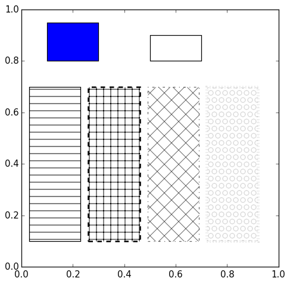

# Matplot Visualization Tutorial

The examples includes:

[](rect.py)

## Quick start 

```python
pip intall -U -r requirements.txt
python rect.py
```

- Author


duangenquan@gmail.com

  

  

  

  

  

