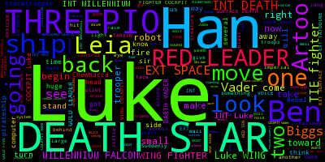
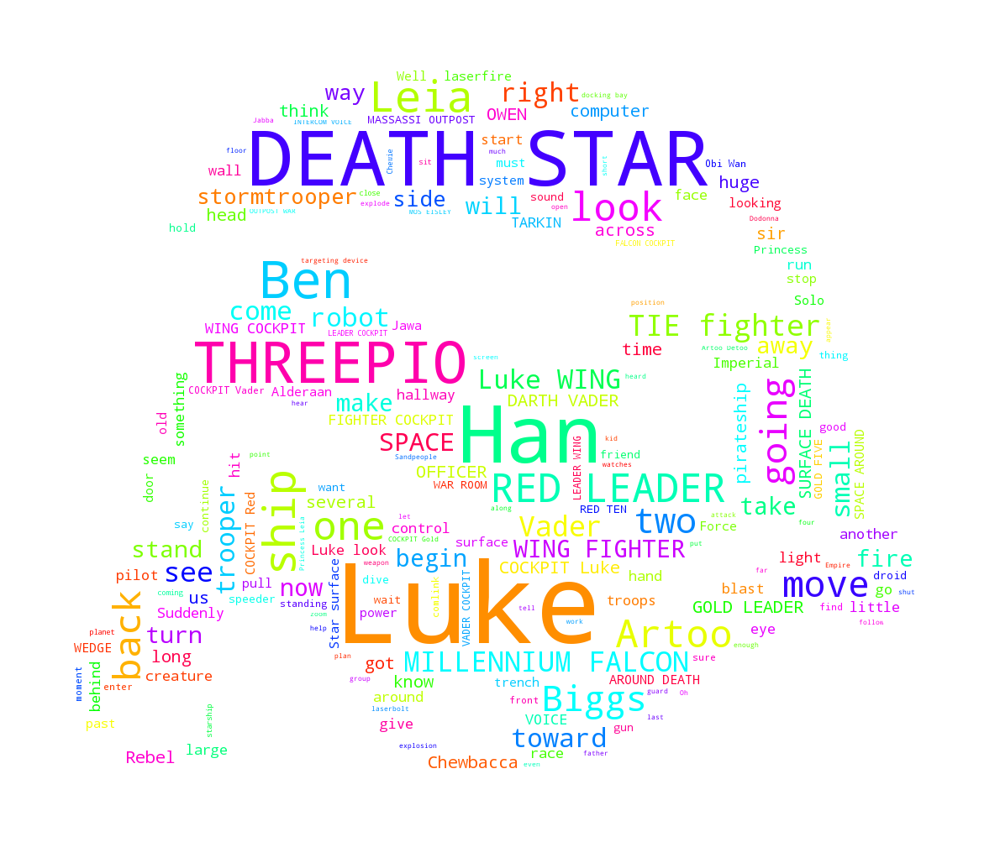
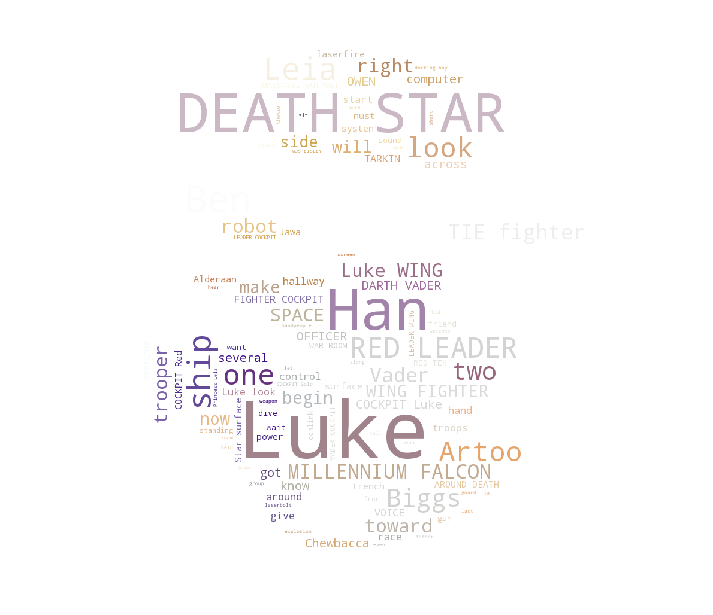
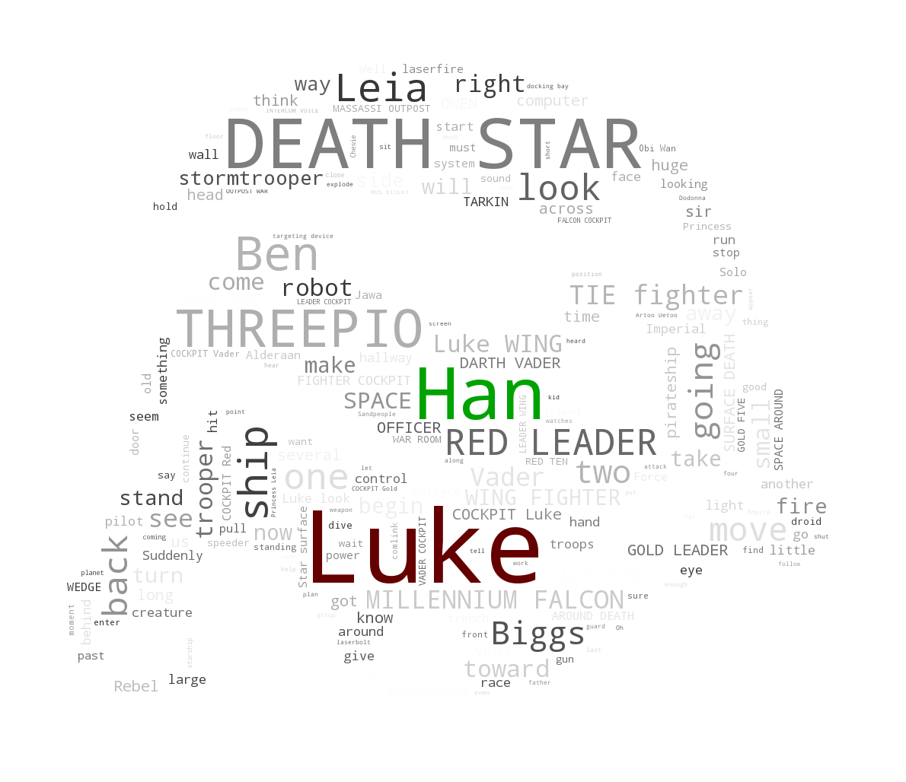
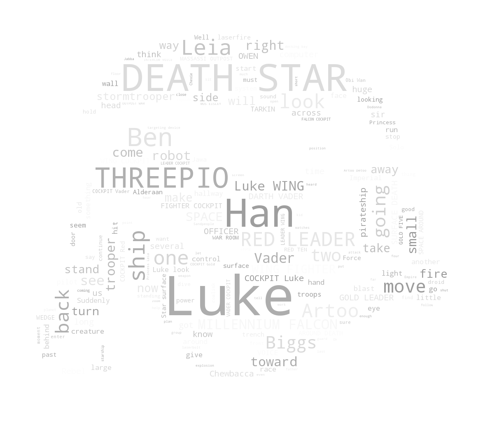

# Word Cloud Example

This repo shows exmaples for word cloud with different visualization settings, modified from [word_cloud/examples](https://github.com/amueller/word_cloud/tree/master/examples).

## Quick start 

```python
pip intall -U -r requirements.txt
python demo.py
```

Results are:
- A square form result

  ​						 

- A colorful result with gray masks and default settings 

- A colorful result with color masks

- A colorful result with coloring some special words

- A gray result with gray masks 

## Tips

- If you would like to see popped up results, please uncomment the last line "plt.show()"

- If you encounter problems to visualize resutls for texts with unicode characters, please try to sepcify fonts. For example, we can use *SimHei.ttf* to visualize Chinese

    ```python
    wc = WordCloud(font_path=r"/Library/Fonts/SimHei.ttf",max_words=200).generate(text)
    ```

# Author
duangenquan@gmail.com

  

  

  

  

  

