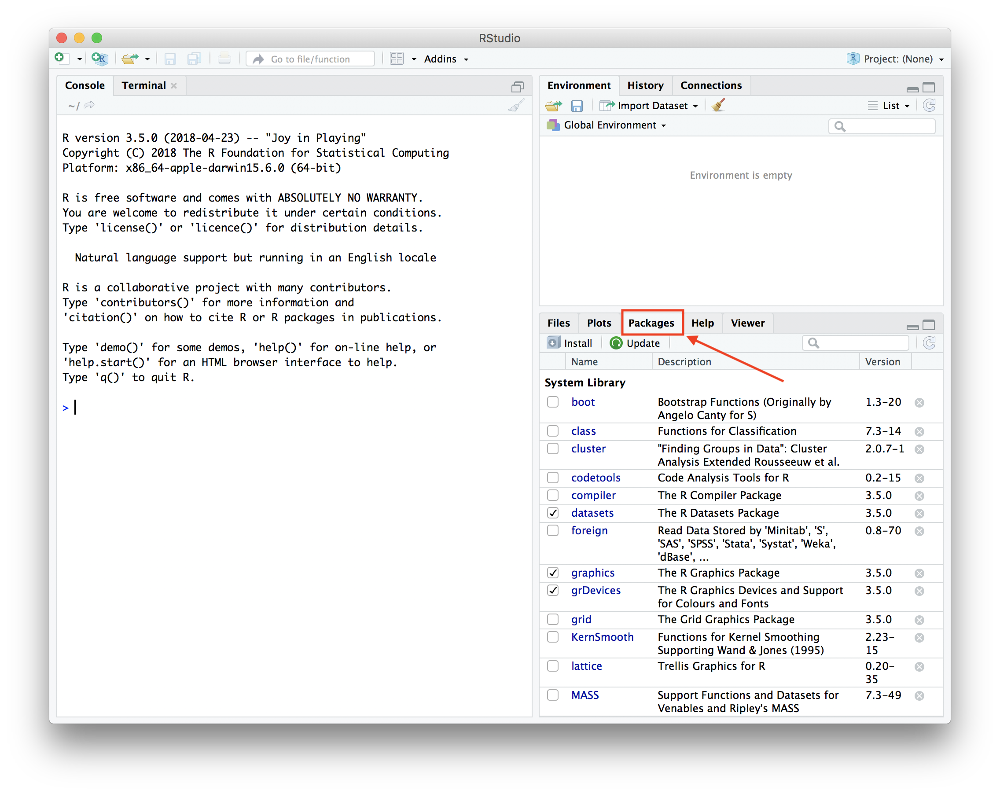

# Some tips for dev

[TOC]

[Gyazo](https://gyazo.com/captures) : online image editor and sharing

# Tech News

[Google Research Blog](https://ai.googleblog.com/)

[Engadget | Technology News, Advice and Features](https://link.zhihu.com/?target=http%3A//www.engadget.com/)

[Small Business Ideas and Resources for Entrepreneurs](https://link.zhihu.com/?target=http%3A//www.inc.com/)

[Entrepreneur - Start, run and grow your business](https://www.entrepreneur.com/)

[WIRED](https://link.zhihu.com/?target=http%3A//www.wired.com/)

[TechCrunch](https://link.zhihu.com/?target=http%3A//techcrunch.com/)

[The Next Web](https://link.zhihu.com/?target=http%3A//thenextweb.com/)

[Business Insider](https://link.zhihu.com/?target=http%3A//www.businessinsider.com/)

[Fast Company](https://link.zhihu.com/?target=http%3A//www.fastcompany.com/)

[Mashable](https://link.zhihu.com/?target=http%3A//mashable.com/)

[Digg - What the Internet is talking about right now](https://link.zhihu.com/?target=http%3A//digg.com/)

[http://techmeme.com/](https://link.zhihu.com/?target=http%3A//techmeme.com/)

[VentureBeat | Tech News That Matters](https://link.zhihu.com/?target=http%3A//venturebeat.com/)

[https://www.allthingsdigital.nl/](https://link.zhihu.com/?target=https%3A//www.allthingsdigital.nl/)

[Gizmodo - Everything Is Technology](https://link.zhihu.com/?target=http%3A//gizmodo.com/)

[Technology News](https://link.zhihu.com/?target=http%3A//www.cnet.com/news/)

[MIT Technology Review](https://link.zhihu.com/?target=http%3A//www.technologyreview.com/)

Reference


# Cloud v.s. Edge

Intel AI DevCloud

# MAC

[Snapshot](https://www.cnet.com/how-to/three-ways-to-take-a-screenshot-on-a-mac/)

- command+shift+3 : whole screen to png
- command+shift+4 : select a region
- command+shift+4   space : select a window to png

Note that, if press these hot keys with control, the screenshot is in memory (not in file).

[Photo Editor](https://www.techradar.com/news/the-best-free-mac-photo-editor)

# R

## [Installation in windows and mac](https://www.andrewheiss.com/blog/2012/04/17/install-r-rstudio-r-commander-windows-osx/)

Highlight installations for Mac OS X

- Download and install [R](http://cran.us.r-project.org/) (R is a powerful open source program for statistics and graphics)
- Download and install [Rstudio](http://rstudio.org/download/desktop) (IDE for R)
- Download and install [TCL/TK](http://cran.r-project.org/bin/macosx/tools/): OS X needs this to run R Commander (A GUI for R)
- Download and install [XQuartz](http://xquartz.macosforge.org/)
- Open Rstudio and open packages 
- Install packages 
- 

## Tutorials

[DataScienceR](https://github.com/ujjwalkarn/DataScienceR)

[Learner](https://github.com/rstudio/learnr)

[Examples](https://gist.github.com/asimihsan/6937989)

```bash
# Create directory if not exists
mainDir = file.path(getwd(),"Documents")
subDir = "reports"
dir.create(file.path(mainDir, subDir), showWarnings = FALSE)
saveDir = file.path(mainDir, subDir)

# Run in cmd
/Library/Frameworks/R.framework/Resources/bin/Rscript example.R


```


# AWS

```bash
# Fix remote problems
chmod 400 xx.pem
```


# Docker

Docker Cheat Sheet( [Github](https://github.com/wsargent/docker-cheat-sheet), [pdf](https://www.docker.com/sites/default/files/Docker_CheatSheet_08.09.2016_0.pdf) )

```bash
# Log into a registry
# Create repo in https://hub.docker.com
docker login
docker login [my.registery.com:8000] --username=yourhubusername --email=youremail@company.com


## Images
# Get one image
docker pull [repo]/[image]:[tag]
# Build an image from Dockerfile and tag the image
docker build -t myapp:1.0 .
# List all images
docker images
# Delete an image from local image store
docker rmi [repo]/[image]:[tag]
# Retag a local image
docker tag myapp:1.0 myrepo/myapp:1.0
# Push an image to registry
docker push myrepo/myapp:1.0

## Containers
# List all running containers
docker ps
# List all exited containers
docker ps -aq -f status=exited
# Remove stopped containers
docker ps -aq --no-trunc -f status=exited | xargs docker rm
# Stop one container
docker stop [container name]
# Remove one container
docker rm [container name]

# Run image in a container
docker run -ti --rm -e DISPLAY=$DISPLAY -v /home/ubuntu:/var/ myapp /bin/bash
# Exit from a container
exit
```

Examples

```bash
docker pull minio/minio
docker run -dti -p 9001:9000 --name demoMinio   -e "MINIO_ACCESS_KEY=admin"   -e "MINIO_SECRET_KEY=admin"   -v /home/ubuntu/data:/data   -v /home/ubuntu/.minio:/root/.minio   minio/minio server /data
```

[Docker CE Alpine](https://wiki.alpinelinux.org/wiki/Alpine_Linux_package_management)

```bash
apk update
apk search xxx
apk add xxx
```

References

> + [Remove docker container](https://zaiste.net/removing_docker_containers/)
> + [Openface](https://github.com/cmusatyalab/openface/blob/master/Dockerfile)
> + [Docker tutorial](https://ropenscilabs.github.io/r-docker-tutorial/04-Dockerhub.html)

# Code Editor

atom

sublime

visual studio

# Git

[Git cheat sheet](https://services.github.com/on-demand/downloads/github-git-cheat-sheet.pdf) ([copy](../cheatsheet/gitcheatsheet.pdf))

Common

```bash
# Clone projects
git clone <project url>

# Set credentials
git config --global user.name "John Doe"
git config --global user.email johndoe@example.com

# If username and password pop up often when commit
# we can use this cmd before commits
git config credential.helper store

# Add commits
git commit -a -m "commit"

# Generate keys
ssh-keygen -t rsa -b 4096 -C "your_email@example.com"
cat ~/.ssh/irs.pub
```

Branches

```bash
# Show all branches
git branch -a
# Create new branches
git checkout -b newbranch
# Delete a local branch
git branch -d branch
# Delete a remote branch
git branch -r -d origin/branch
# Sync with server to prune branches
git fetch --prune
```


Clone one branch only

```bash
git clone -b mybranch --single-branch git://sub.domain.com/repo.git
```

Submodule

```bash
# Add one submodule
git submodule add https://github.com/socketio/socket.io 
# Update one submodule 
git submodule update --init --recursive
# Clone a project with submodules
git clone --recursive <project url>
```

Delete history

```bash
# $1 is SHA-1 of the commit you want to keep
git checkout --orphan temp $1 
git commit -m "Truncated history" 
git rebase --onto temp $1 master 
git branch -D temp
git gc --prune=all
git repack -a -f -F -d
```


# ffmpeg

## Hardware Acceleration with Intel


References

https://stackoverflow.com/questions/36260474/encoding-of-two-full-hd-streams-in-linux-gpu-with-intel-hd4000-va-api-ffmp

https://wiki.archlinux.org/index.php/Hardware_video_acceleration#Installing_VA-API

https://trac.ffmpeg.org/wiki/Hardware/QuickSync

https://software.intel.com/en-us/articles/accessing-intel-media-server-studio-for-linux-codecs-with-ffmpeg

https://software.intel.com/en-us/blogs/2016/02/28/faster-media-apps-by-using-hw-acceleration

https://software.intel.com/en-us/articles/video-transcoding-on-intel-xeon-scalable-processor-with-ffmpeg

[Intel MovAVI](http://img.movavi.com/online-help/videoconverter/15/nvidia_hardware_acceleration.htm?st=MA%3D%3D&sct=MA%3D%3D&mw=MzAw&ms=AgE%3D)


## Build

[ffmpeg compile guide](https://trac.ffmpeg.org/wiki/CompilationGuide/Ubuntu)

[ffmpeg build script](https://github.com/markus-perl/ffmpeg-build-script)

[ffmpeg streaming](https://telecom.altanai.com/category/media-processes/live-streaming-and-broadcasting/)

```bash
# Preliminary
sudo apt-get install g++ gcc build-essential liblzma-dev libva-dev libfaac-dev libnuma-dev libsdl2-dev libbz2-dev libssl-dev libvdpau-dev idn libnss3-dev nasm

# Curl
wget https://curl.haxx.se/download/curl-7.47.1.tar.bz2
tar -vxjf curl-7.47.1.tar.bz2
CFLAGS=-fPIC ./configure --with-crypto --with-idn --with-ssl --with-nss
make

# H264
wget ftp://ftp.videolan.org/pub/x264/snapshots/last_x264.tar.bz2
tar --bzip2 -xvf last_x264.tar.bz2
cd x264-snapshot-XXXXXXXX-XXXX/
CFLAGS=-fPIC  ./configure --enable-static --enable-shared
make
sudo make install

# ffmpeg
wget http://ffmpeg.org/releases/ffmpeg-4.0.tar.bz2
tar -zxvf ffmpeg-4.0.tar.bz2
cd ffmpeg-xxx/
CFLAGS=-fPIC ./configure --enable-libx264 --enable-gpl --enable-shared

```


Run compiled ffmpeg

```bash
sudo make install
sudo vim /etc/ld.so.conf
# Add /usr/local/lib at the end of ld.so.conf
./ffmpeg
```


## Tips

```bash
# concate videos
printf "file '%s'\n" ./*.mp4 > list.txt
./ffmpeg -f concat -safe 0 -i list.txt -c copy output.mp4

# Link orders
LFLAGS += -lm -lX11 -lvdpau -lva-drm -lva-x11 -lva

# ffmpeg_g contains debug information for ffmpeg

```


# C++ Profiling in Linux

[cpuload example](https://github.com/gklingler/cpuProfilingDemo/blob/master/cpuload.cpp).

## valgrind

```bash
#!/bin/bash
# install valgrind & kcachegrind
sudo apt-get install valgrind
sudo apt-get install kcachegrind

# build the program (no special flags are needed)
g++ -std=c++11 cpuload.cpp -o cpuload

# run the program with callgrind; generates a file callgrind.out.12345 that can be viewed with kcachegrind
valgrind --tool=callgrind ./cpuload

# open profile.callgrind with kcachegrind
kcachegrind callgrind.out.xxxxx
```

Note that, please enable debug information when compiling by

```bash
CFLAGS+=-ggdb
NOSTRIP=1
```

## gperftools

Step 1. Make binary with debug information

```bash
sudo apt-get install google-perftools
sudo apt-get install tau
sudo ln -s /usr/lib/libprofiler.so.0 /usr/lib/libprofiler.so

CFLAGS += -DWITHGPERFTOOLS
LFLAGS += -lprofiler
```

Step 2. Run a binary as normal

```bash
./cpuload
```

Step 3. Run prof

```bash
google-pprof --callgrind ./cpuload profile.log > profile.callgrind
kcachegrind profile.grind
```


## gprof

Step 1. Add -pg argument to the compiler's command line

```bash
g++ -Wall -g -pg cpuload.cpp -o kruse
```

The binary should not loop infinitely. 

Step 2. Run a binary as normal

```bash
./kruse param1 param2
```

After execution, gmon.out wil be obtained automatically.

Step 3. Run grof binary > output.log

```bash
gprof kruse > output.log
```

 

References

> - [gprof, valgrind, gperftool](http://gernotklingler.com/blog/gprof-valgrind-gperftools-evaluation-tools-application-level-cpu-profiling-linux/)
> - [gprof Quick-Start Guide](https://web.eecs.umich.edu/~sugih/pointers/gprof_quick.html)
> - [gperftools wiki](http://kratos-wiki.cimne.upc.edu/index.php/How_to_Profile_an_application_(using_google-perftools))
> - 

# Others


```bash
# check missing .so dependencies
ldd binary
```


# Author

duangenquan@gmail.com