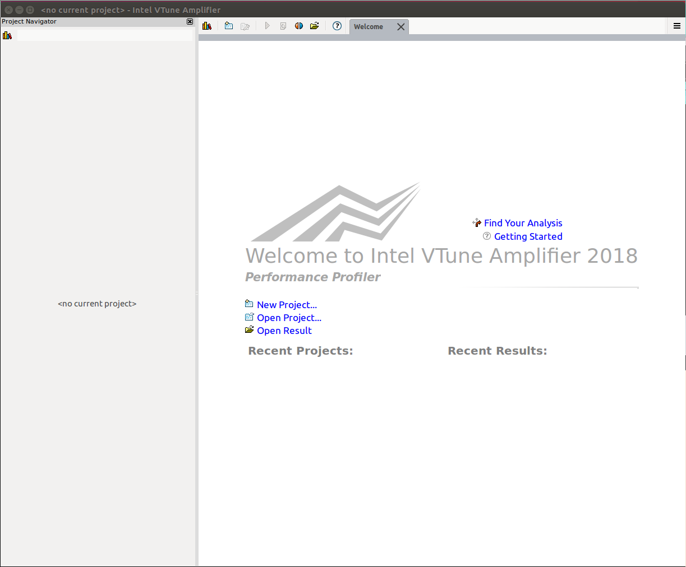
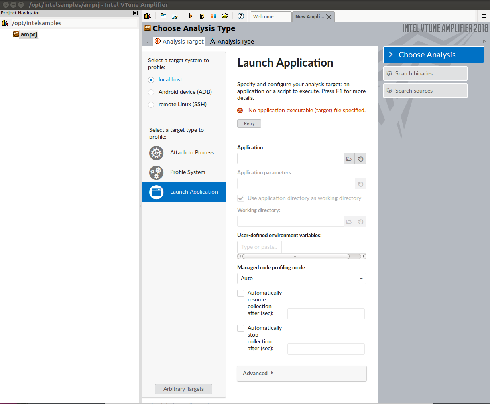
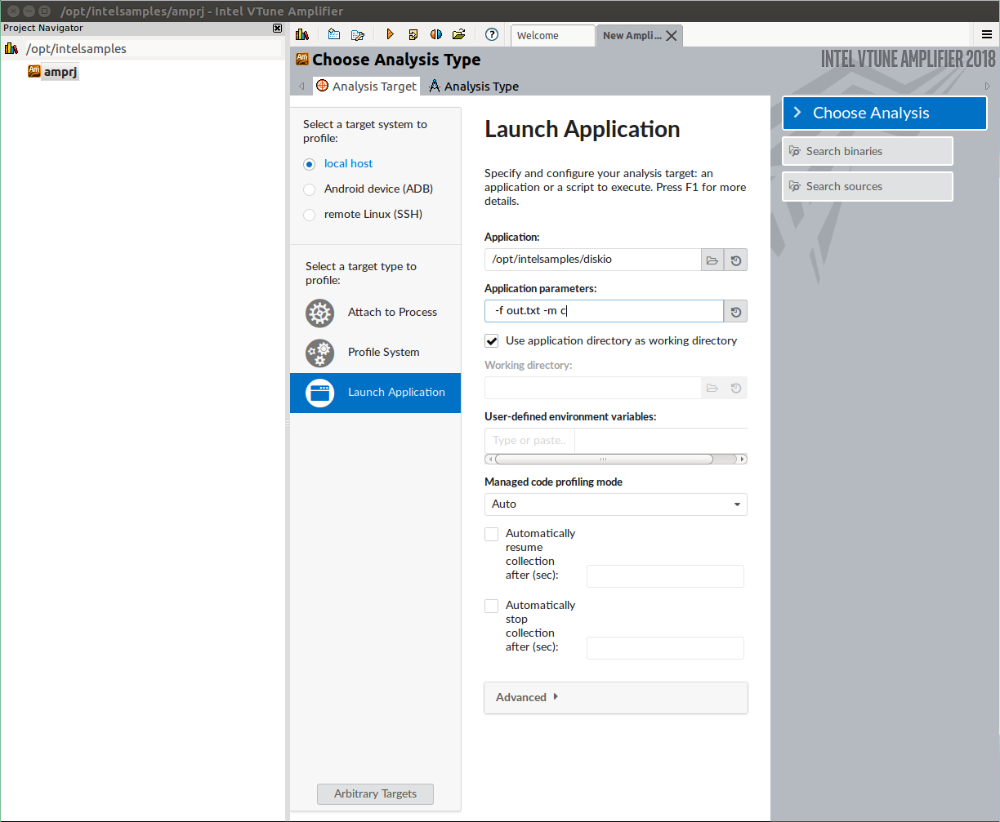
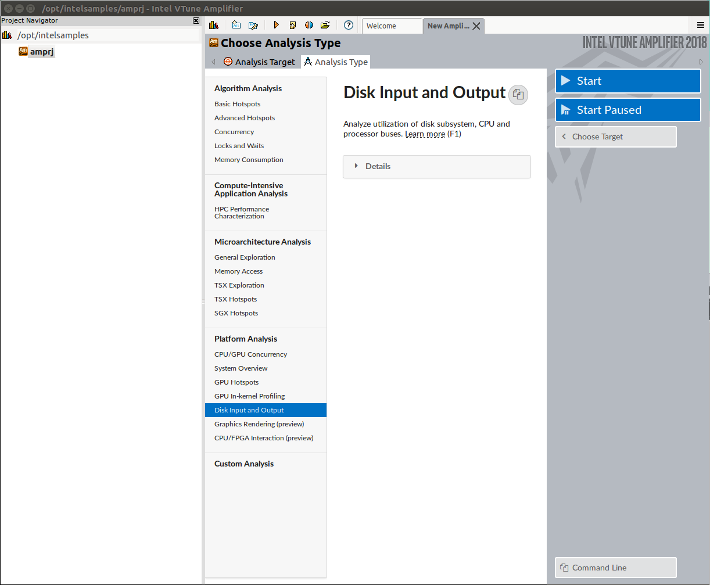
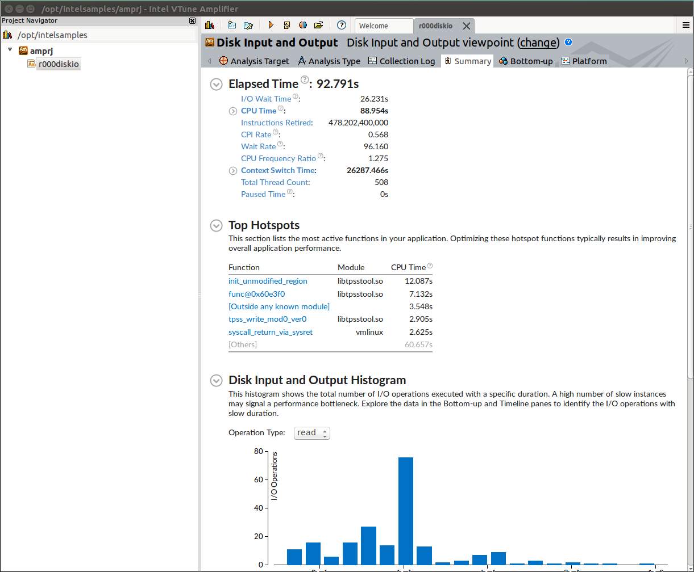

# Intel Vtune Tutorials

This tutorial shows how to install intel-vtune-amplifier-xe 2018 and walk through some examples in ubuntu16.04.

### Step 1. Download [intel-vtune-amplifier-xe](https://software.intel.com/en-us/intel-vtune-amplifier-xe)

​    Note that the serial number (formated as xxxx-xxxxxxxx) will be used during installation. 

### Step 2. Install intel-vtune-amplifier-xe

```bash
sh ./Install_GUI.sh
```

>  + Set installation dir
>     + The default installation dir is /opt/intel/vtune_amplifier_<version>.<version_minor>.<update_number>.<build_number>.
>     + If you would like to change the path, please use *-target-install-dir=<string>*
>  + Examples for c++/fortran are in ./samples/en
>       More descriptions can be found in [help](https://software.intel.com/en-us/vtune-amplifier-help-tutorials-and-samples) and [tutorials](https://software.intel.com/en-us/articles/intel-vtune-amplifier-tutorials).

### Step 3. Walk through diskio example

​    **Get diskio sources**
```bash
cp <install_dir>/samles/en/C++/diskio_vtune_amp_xe.tgz <your_dir>
sudo tar -xvzf diskio_vtune_amp_xe.tgz
cd diskio
make
```
​    **Create a performance baseline**
```bash
time ./diskio -f output.txt -m c
```
​	with sample results:

```bash
real	2m58.403s
user	0m5.220s
sys	2m53.135s
```

>   The operation modes for *m* are as below.
>   + a writes data (16 bytes) to the user buffers and asynchronously submits them to the disk.
>   + c writes data (16 bytes) asynchronously to the output file using the system file cache;
>   + b writes data (16 bytes) to the user buffer (1024 records) and then writes the buffer to a file using the system file cache;
>   + s writes data (16 bytes) synchronously to the user buffer (1024 records) and writes the buffer directly to the I/O device without using the system file cache.

​    **Performance evaluation**

>    + Step 3.1: Open amplxe-gui
    ```
    cd <install_dir> (e.g. cd /opt/intel/vtune_amplifier_2018.2.0.551022)
    source amplxe-vars.sh
    amplxe-gui
    ```
    

>    + Step 3.2: Click "New Project" and set project name & location 

>    + Step 3.3: Config analysis target: "Analysis Target" -> "local host" -> "Launch Application" -> Input application path and parameters
    
>    + Step 3.4: Select and run the analysis: "Analysis Type" -> "Disk Input and Output" -> Start
                    

>    + Step 3.5: Check analyzed results in tabs "Summary", "Bottom-up", and "Platform" (there might be other tabs if you use other types of analysis).
    


​      
# Author

​duangenquan@gmail.com    

